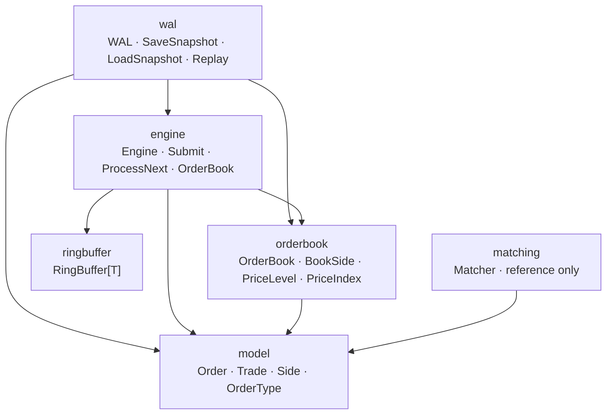
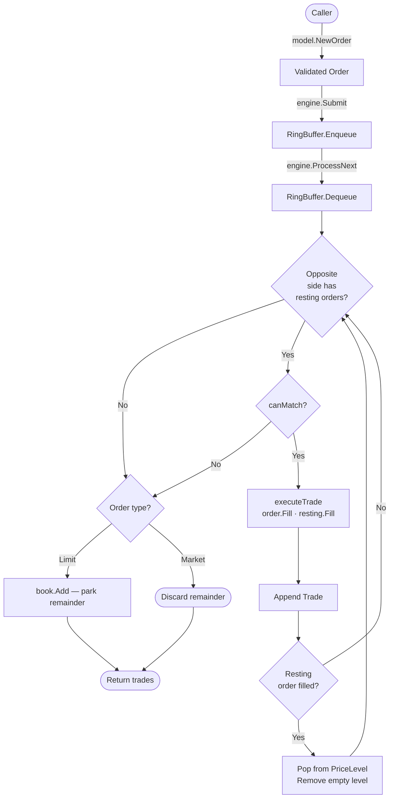
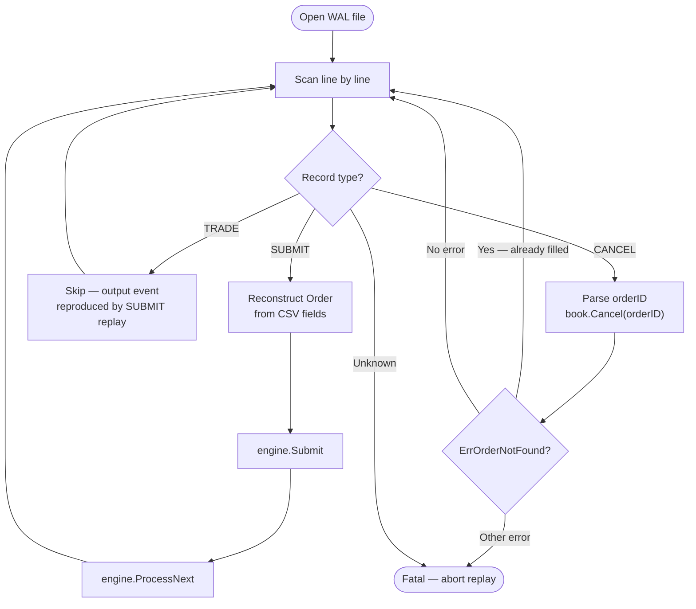

# Matching Engine

A production-inspired limit order book and matching engine implemented in Go from first principles.

The project covers the full lifecycle of an exchange order: ingestion through a fixed-capacity ring buffer, price-time priority matching across multiple price levels, partial fills, order cancellation, write-ahead logging for durability, crash recovery via WAL replay, and state serialisation via JSON snapshots.

Zero external dependencies. No generated code. Everything is hand-written and explained.

---

## Why This Was Built

Most systems programming tutorials stop at theory. This project was built to answer a harder question: can every component of a matching engine — the data structures, the persistence layer, the recovery mechanism — be implemented correctly from first principles, with a full understanding of *why* each design decision exists?

The `docs/` directory contains the learning path that preceded the code: specifications written before implementation, design documents, and a systems programming handbook covering memory models, goroutine scheduling, atomics, lock-free programming, and channels. The code is the final product of that process.

---

## Key Features

| Feature | Details |
|---|---|
| **Price-time priority** | FIFO within each price level; best price across levels |
| **Limit orders** | Resting in the book at the specified price or better |
| **Market orders** | Execute immediately against best available prices; unfilled quantity is discarded |
| **Partial fills** | A single incoming order can consume multiple resting orders across multiple price levels |
| **Order cancellation** | Remove any resting order by ID |
| **Write-ahead log (WAL)** | Every submit and cancel is fsynced to disk before acknowledgement |
| **WAL replay** | Deterministic crash recovery by replaying the input log |
| **JSON snapshots** | Fast state capture and restore for warm restart |
| **Generic ring buffer** | Fixed-capacity circular queue (`RingBuffer[T any]`) decouples ingestion from processing |
| **No external dependencies** | Pure Go standard library |
| **Race detector clean** | `go test -race ./...` passes |

---

## Repository Structure

```
matching-engine-journey/
│
├── docs/
│   ├── notes/              Systems programming handbook (memory, goroutines,
│   │                       scheduler, atomics, lock-free, channels)
│   ├── specification/      Behavioural contracts written before implementation
│   │   ├── matching-rules.md
│   │   ├── order-lifecycle.md
│   │   └── api-contract.md
│   ├── designs/            Architecture design documents
│   ├── experiments/        Scheduler and concurrency experiments
│   └── questions/          Self-study question sets
│
└── matching-engine/        Go implementation
    ├── cmd/playground/     Standalone goroutine/channel demo
    ├── internal/
    │   ├── model/          Domain types: Order, Trade, Side, OrderType
    │   ├── engine/         Orchestrator: ring buffer + order book + matching loop
    │   ├── orderbook/      Book structure: sides, price levels, price index
    │   ├── ringbuffer/     Generic fixed-capacity circular queue
    │   ├── matching/       Pairwise matcher (reference implementation)
    │   └── wal/            Write-ahead log, replay, and JSON snapshots
    └── pkg/                Reserved for future public API surface
```

---

## Architecture

### Package Dependency Graph



**Data flows one way.** `model` has no imports. `ringbuffer` has no imports. `orderbook` depends only on `model`. `engine` composes `ringbuffer` and `orderbook`. `wal` sits above `engine` and `orderbook` to log and restore state.

### Package Responsibilities

| Package | Responsibility |
|---|---|
| `model` | Pure domain types. Validation at construction. No I/O, no side effects. |
| `ringbuffer` | Generic fixed-capacity SPSC queue. O(1) enqueue and dequeue. No allocations after init. |
| `orderbook` | Maintains resting state: price levels, sorted price index, cancellation. Stateful, not concurrent. |
| `engine` | Dequeues orders from the ring buffer and runs the matching loop. Single-threaded by design. |
| `wal` | Appends every event to an fsync'd file. Provides replay and snapshot for recovery. |
| `matching` | Early-iteration pairwise matcher. Preserved as a reference; the engine implements its own inline matching loop. |

---

## Order Lifecycle



### Order States

```
NEW → VALIDATED → QUEUED → MATCHING → PARTIALLY_FILLED → FILLED
                                    ↘                  → CANCELLED
                                      REJECTED
```

| State | Description |
|---|---|
| `NEW` | Order received from caller |
| `VALIDATED` | Passed `model.NewOrder` validation |
| `QUEUED` | Sitting inside the ring buffer |
| `MATCHING` | Being processed by `ProcessNext` |
| `PARTIALLY_FILLED` | One or more trades executed; remainder resting in the book |
| `FILLED` | `order.Remaining == 0` |
| `CANCELLED` | Removed from book before completion |
| `REJECTED` | Failed validation (zero quantity, missing symbol, invalid limit price) |

---

## Matching Algorithm

`ProcessNext` dequeues one order and runs the following loop:

```
while order.Remaining > 0:
    best  ← opposite side's best price level
    if best is nil: break
    
    resting ← best.Front()       // oldest order at that price (FIFO)
    if not canMatch(order, resting): break
    
    qty   ← min(order.Remaining, resting.Remaining)
    trade ← executeTrade(buy, sell, qty)   // price = sell.Price
    
    order.Fill(qty)
    resting.Fill(qty)
    
    if resting.Filled():
        best.Pop()
        if best is empty: remove price level from book

if order.Remaining > 0 and order is Limit:
    book.Add(order)    // park remainder as resting order
```

### Price Determination

The trade price is always the **passive (resting) order's price**. This is standard for central limit order books:

- A limit buy at 105 matched against a resting sell at 100 → **trade at 100**
- A market sell matched against a resting buy at 102 → **trade at 102**

### `canMatch` Logic

```go
// Market orders match unconditionally.
// Limit buy:  buy.Price >= sell.Price  (buyer willing to pay at least the ask)
// Limit sell: buy.Price >= sell.Price  (buyer's bid meets or exceeds the ask)
func canMatch(incoming, resting *model.Order) bool {
    if incoming.Type == model.Market {
        return true
    }
    if incoming.Side == model.Buy {
        return incoming.Price >= resting.Price
    }
    return resting.Price >= incoming.Price
}
```

---

## Price-Time Priority

Within a single price level, orders execute in **FIFO order** — the order that arrived first executes first. Across price levels, the **best price** always executes first.

**Example — buy side (bids, highest first):**

| Priority | Order ID | Price | Quantity | Arrived |
|---|---|---|---|---|
| 1st | 7 | 105 | 30 | 09:31:00 |
| 2nd | 3 | 105 | 50 | 09:31:05 |
| 3rd | 12 | 103 | 20 | 09:30:59 |
| 4th | 1 | 100 | 100 | 09:30:00 |

Order 7 and 3 are at the same price. Order 7 executes first because it arrived earlier.

**Example — sell side (asks, lowest first):**

| Priority | Order ID | Price | Quantity | Arrived |
|---|---|---|---|---|
| 1st | 5 | 100 | 40 | 09:31:01 |
| 2nd | 9 | 101 | 20 | 09:31:03 |
| 3rd | 2 | 102 | 60 | 09:30:55 |

---

## Order Book Design

The order book is structured in three layers:

```
OrderBook
├── buys  (BookSide — desc price order)
│   ├── levels: map[price → PriceLevel]   O(1) lookup by price
│   └── index:  PriceIndex (sorted slice)  O(1) best price
│       PriceLevel (per price)
│       └── orders: []*Order              FIFO slice
│
└── sells (BookSide — asc price order)
    ├── levels: map[price → PriceLevel]
    └── index:  PriceIndex (sorted slice)
```

### `PriceLevel`

A FIFO queue of orders at a single price point. `Add` appends to the tail; `Pop` removes from the head. `Remove(orderID)` performs a linear scan for cancellation.

```go
type PriceLevel struct {
    price  uint64
    orders []*model.Order   // FIFO; index 0 is the oldest
}
```

### `PriceIndex`

A sorted slice of distinct prices. Configured as descending for bids (highest first) and ascending for asks (lowest first). `Best()` returns `prices[0]` in O(1). New prices are inserted and the slice is re-sorted; existing prices are deduplicated before insertion.

```go
type PriceIndex struct {
    prices []uint64
    desc   bool   // true = bids (highest first), false = asks (lowest first)
}
```

### `BookSide.Cancel`

Cancellation scans all price levels for the given order ID. If found, the order is spliced out of the level's slice. If the level becomes empty, it is removed from both the map and the price index.

This is deliberately O(P × L) where P is the number of distinct price levels and L is the average orders per level. An O(1) implementation using an order-ID lookup map is noted as a future improvement.

---

## Ring Buffer

The ring buffer decouples the submission path from the processing path. It is a generic, fixed-capacity circular queue with no allocations after initialisation.

```go
type RingBuffer[T any] struct {
    buffer     []T
    readIndex  int
    writeIndex int
    size       int
    capacity   int
}
```

**Invariants:**
- Empty: `size == 0`
- Full: `size == capacity`
- Wrap-around: `index = (index + 1) % capacity`

The buffer size is set at construction. If the buffer is full, `Enqueue` returns `ErrBufferFull` immediately — there is no blocking or dynamic resizing by design.

**Single-threaded.** The engine is not concurrent; the ring buffer has no locks. Concurrency would be added at the layer that drives `Submit` and `ProcessNext` calls.

---

## Write-Ahead Log (WAL)

The WAL is an append-only text file. Every event is written and fsynced to disk before the operation is considered durable.

### Record Format

```
SUBMIT,<id>,<symbol>,<side>,<type>,<price>,<quantity>
TRADE,<id>,<buyOrderID>,<sellOrderID>,<symbol>,<price>,<quantity>
CANCEL,<orderID>
```

### Example

```
SUBMIT,1,AAPL,BUY,LIMIT,10000,100
SUBMIT,2,AAPL,SELL,LIMIT,9900,50
TRADE,0,1,2,AAPL,9900,50
SUBMIT,3,AAPL,SELL,LIMIT,10100,30
CANCEL,3
```

### Design Choice: Text vs Binary

The WAL uses a human-readable CSV format. This makes debugging straightforward at the cost of parse overhead compared to a length-prefixed binary format. For a learning project and for operational observability, this is the right tradeoff.

---

## Replay

On startup after a crash, the WAL is read from the beginning and replayed into a fresh engine. Each record type is handled differently:



**Key insight:** TRADE records are *output* — they describe what the engine produced. When SUBMIT records are replayed in order, the engine deterministically reproduces the same trades. Replaying TRADE records would double-count. They are skipped.

**Key insight:** A CANCEL record may target an order that was already fully filled before the cancel could execute. `ErrOrderNotFound` is silently ignored during replay; it is an expected outcome of the original race between matching and cancellation.

---

## Snapshots

A snapshot serialises the current resting state of the order book to a JSON file. It is a complement to the WAL: after taking a snapshot, the WAL can be truncated, and recovery becomes snapshot load + WAL replay of only the records written after the snapshot.

### Snapshot Format

```json
{
  "buys": [
    {
      "price": 10000,
      "orders": [
        { "id": 1, "symbol": "AAPL", "side": "BUY", "type": "LIMIT",
          "price": 10000, "remaining": 60 }
      ]
    }
  ],
  "sells": []
}
```

`remaining` — not `quantity` — is persisted. A partially-filled order that was resting at the time of the snapshot is restored with only its unfilled quantity. The original fill history is not needed for matching purposes.

### Save and Load

```go
// Save the current book to disk.
err := wal.SaveSnapshot("snapshot.json", engine.OrderBook())

// Restore on next startup.
book, err := wal.LoadSnapshot("snapshot.json")
```

`SaveSnapshot` fsyncs the file before returning. `LoadSnapshot` validates price and side consistency for every restored order before adding it to the book.

---

## Testing

Every package has a dedicated test file. Tests are written with the standard `testing` package, no test framework.

```
internal/model/         order_test.go  ordertype_test.go  side_test.go  trade_test.go
internal/ringbuffer/    ringbuffer_test.go
internal/orderbook/     orderbook_test.go  bookside_test.go  pricelevel_test.go  priceindex_test.go
internal/matching/      matcher_test.go
internal/engine/        engine_test.go
internal/wal/           wal_test.go  snapshot_test.go
```

### What is tested

| Area | Tests |
|---|---|
| Order validation | Zero quantity, zero limit price, invalid side, invalid type |
| Order fills | Partial fill, overfill guard, `Filled()` predicate |
| FIFO ordering | `PriceLevel` — insertion order preserved across `Pop` |
| Best price | `PriceIndex` — highest bid first, lowest ask first, after remove |
| Cancel | Cancel by ID, cancel middle order same price, level cleanup |
| Multi-level matching | Buy sweeps across 3 sell levels, correct quantities and prices |
| Partial fill (resting) | Incoming buy partially fills a resting sell; remainder stays in book |
| Market order | Consumes best prices unconditionally; does not rest in book |
| WAL format | `LogSubmit`, `LogTrade`, `LogCancel` produce correct CSV records |
| WAL replay (SUBMIT) | Replayed orders reconstruct identical book state |
| WAL replay (CANCEL) | Replayed cancels remove resting orders |
| WAL replay (late cancel) | Cancel targeting a filled order does not error |
| WAL replay (TRADE skip) | TRADE records in WAL do not fail replay |
| Snapshot round-trip | `SaveSnapshot` + `LoadSnapshot` preserves price levels, order IDs, and remaining quantities |
| Ring buffer wrap-around | Circular index wraps correctly after mixed enqueue/dequeue sequence |

---

## Benchmarks

All benchmarks use `b.ReportAllocs()` to track heap allocations per operation.

### Engine benchmarks (`internal/engine`)

| Benchmark | What it measures |
|---|---|
| `BenchmarkProcessLimitOrders` | End-to-end submit + process cycle for non-matching limit orders |
| `BenchmarkSubmit` | Ring buffer enqueue throughput only |
| `BenchmarkMatch/resting-100` | Incoming orders matched against 100 resting orders |
| `BenchmarkMatch/resting-500` | Matched against 500 resting orders |
| `BenchmarkMatch/resting-1000` | Matched against 1000 resting orders |
| `BenchmarkCancel/orders-100` | Cancel 100 resting orders by ID (O(n) scan) |
| `BenchmarkCancel/orders-500` | Cancel 500 resting orders |
| `BenchmarkCancel/orders-1000` | Cancel 1000 resting orders |

`BenchmarkMatch` and `BenchmarkCancel` use `b.StopTimer` / `b.StartTimer` to exclude setup from the measured window. Parameterisation across sizes makes linear vs sub-linear behaviour visible.

### WAL benchmarks (`internal/wal`)

| Benchmark | What it measures |
|---|---|
| `BenchmarkReplay` | Full replay of a 10 000-record WAL into a fresh engine |

---

## Complexity

| Operation | Complexity | Notes |
|---|---|---|
| `Submit` (enqueue) | **O(1)** | Ring buffer write; no allocation |
| `ProcessNext` — no match | **O(1)** | One dequeue; `Best()` is O(1) |
| `ProcessNext` — T trades | **O(T)** | Each trade iteration is O(1) |
| `Best()` price lookup | **O(1)** | `PriceIndex.prices[0]` |
| `PriceLevel.Add` | **O(1)** | `append` |
| `PriceLevel.Pop` | **O(1)** | Reslice |
| New price level insert | **O(P log P)** | `sort.Slice` over P distinct prices |
| `Cancel` | **O(P × L)** | Scan all levels; no order-ID index |
| WAL write | **O(1) + fsync** | One `WriteString` + `Sync` |
| WAL replay | **O(N)** | One pass over N records |
| Snapshot save/load | **O(N)** | N = total resting orders |

**P** = number of distinct price levels on one side  
**L** = average orders per price level  
**T** = number of trades produced by one `ProcessNext` call  
**N** = total records (WAL) or total orders (snapshot)

---

## Getting Started

**Requirements:** Go 1.21 or later (no other dependencies)

```sh
cd matching-engine
```

### Run all tests

```sh
go test ./...
```

### Run tests with the race detector

```sh
go test -race ./...
```

### Run static analysis

```sh
go vet ./...
```

### Run engine benchmarks

```sh
go test -bench=. -benchmem ./internal/engine/
```

### Run engine benchmarks for a fixed duration

```sh
go test -bench=. -benchmem -benchtime=3s ./internal/engine/
```

### Run WAL replay benchmark

```sh
go test -bench=. -benchmem ./internal/wal/
```

### Run a specific benchmark

```sh
go test -bench=BenchmarkMatch -benchmem ./internal/engine/
```

---

## Project Philosophy

Every component in this project was implemented only after understanding:

1. **Why it exists** — what problem does it solve, and what are the alternatives?
2. **The tradeoffs** — what does this design give up, and what does it gain?
3. **The implementation** — how does it work at the data-structure level?
4. **Performance characteristics** — where are the O(n) operations, and are they acceptable?
5. **Production considerations** — what would need to change before this ran in a real exchange?

This methodology is reflected in the `docs/` directory, where specifications were written before code, and where a systems programming handbook (memory, goroutines, scheduler, atomics, lock-free programming, channels) documents the theoretical foundation built before writing a single line of the engine.

---

## Known Limitations

These are acknowledged design constraints, not bugs:

| Limitation | Reason |
|---|---|
| **Single-threaded engine** | Correct concurrent access requires a lock-free queue or explicit synchronisation. Concurrency is deferred until the single-threaded path is fully understood. |
| **O(n) cancellation** | No order-ID lookup map. Cancel scans all price levels. Correct but not scalable to very large books. |
| **Single symbol** | One engine instance manages one instrument. Multi-symbol support requires a symbol-keyed map of engines. |
| **No HTTP API** | The engine is a pure library. Serving orders over a network transport is a future layer. |
| **WAL not integrated into Engine** | The WAL is deliberately external. The engine is a pure computation unit; persistence is the caller's responsibility. |

---

## Future Improvements

| Improvement | Value |
|---|---|
| O(1) cancellation via order-ID map | Eliminates the O(P × L) cancel scan |
| Multi-symbol order books | Symbol-keyed map of engines; one engine per instrument |
| HTTP API for order submission and book queries | Exposes the engine as a network service |
| Lock-free ring buffer (CAS-based) | Enables safe concurrent producer and consumer |
| Order flow simulator | Synthetic workload generation for throughput measurement |
| WAL truncation after snapshot | Bounds WAL growth; recovery becomes snapshot + incremental WAL |
| Profiling and `pprof` integration | Identifies hot paths under realistic workloads |