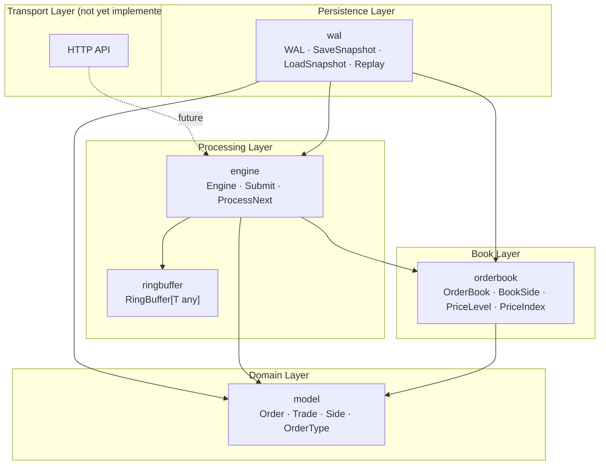
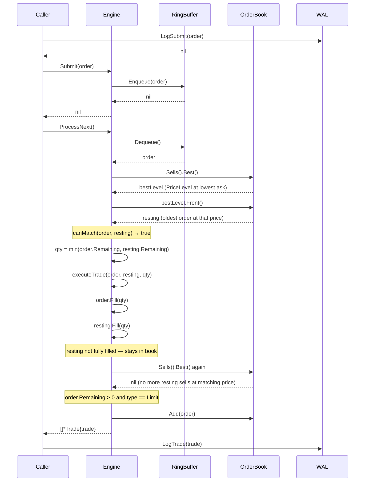
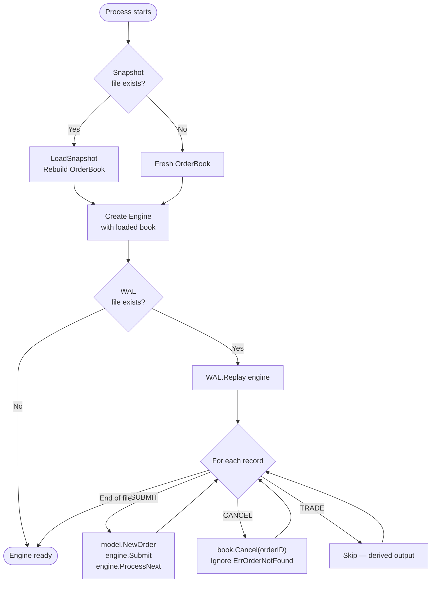

# Architecture

This document describes the internal design of the matching engine — how the packages are structured, why each engineering decision was made, and what tradeoffs were consciously accepted. It is intended for engineers reading the source code who want to understand the reasoning behind the implementation, not just the mechanics.

---

## 1. Overview

The matching engine implements a central limit order book (CLOB) for a single financial instrument. It accepts limit and market orders, matches them using price-time priority, produces trade records for every execution, and provides durability through a write-ahead log and point-in-time snapshots.

The system is designed as a library, not a service. There is no network transport, no HTTP handler, and no goroutine management. The caller drives every operation explicitly. This is intentional.

---

## 2. Design Goals

Six goals guided every implementation decision:

**Correctness before performance.** Every data structure is correct first. Prices are `uint64` (fixed-point integers) rather than `float64` — floating-point arithmetic is non-associative and subject to rounding error, which is unacceptable in a financial system. Order validation runs at construction; no valid `Order` value can exist with a zero quantity or a zero limit price.

**Determinism.** The engine produces the same output for the same sequence of inputs, every time. This property is not incidental — it is what makes WAL replay possible. If matching were non-deterministic, recovery would be impossible without storing every trade explicitly.

**Simplicity over abstraction.** Interfaces and abstractions are used only where they add value. The engine is a concrete struct, not an interface. The orderbook is not hidden behind an abstract storage layer. This makes the code easier to read, trace, and test.

**Modularity through clear boundaries.** Each package has exactly one job. The orderbook stores orders; it does not match them. The engine matches; it does not persist. The WAL persists; it does not route. These boundaries are enforced by Go's `internal/` package constraint — nothing outside `matching-engine/` can import these packages.

**Testability.** Every package is independently testable. The `model` package has no side effects. The `orderbook` package can be tested without an engine. The `engine` package can be tested without a WAL. Small, focused packages with no hidden state are easier to reason about and easier to test.

**Fail fast on programming errors; return errors on operational failures.** `ringbuffer.New` panics if capacity is zero — that is a programming error, not a runtime condition. `engine.Submit` returns `ErrBufferFull` — that is an operational condition the caller must handle.

---

## 3. High-Level Architecture

### Layer Diagram



### Dependency Direction

Dependencies flow strictly downward. The `model` package imports nothing from this module. The `orderbook` package imports only `model`. The `engine` package imports `model`, `orderbook`, and `ringbuffer`. The `wal` package sits above `engine` and `orderbook` — it knows enough about both to reconstruct state.

This structure has a concrete benefit: any package can be tested without mocking anything above it. You can test `PriceLevel` without an engine. You can test an `Engine` without a WAL. The dependency graph is also a test isolation graph.

The `matching` package (a pairwise reference implementation) sits alongside `model` with no connections to `engine` or `orderbook`. It is a preserved design artifact.

---

## 4. Package Responsibilities

### `model` — Domain types

The `model` package defines the language of the system. Every other package speaks in terms of `Order` and `Trade`.

**Key types:** `Order`, `Trade`, `Side`, `OrderType`

**Why it exists:** Centralising domain types prevents import cycles and ensures that all packages share the same data representation. A `Trade` produced by the engine is the same type the WAL persists and the caller receives.

**Why `uint64` for price and quantity:** Financial arithmetic requires exact representation. `float64` cannot represent all decimal values exactly — `0.1 + 0.2 != 0.3` in IEEE 754. Prices in `uint64` represent fixed-point integers (e.g., cents or basis points). Arithmetic on integers is exact.

**What it deliberately does not do:** `model` has no knowledge of the order book, matching rules, or persistence. An `Order` does not know whether it is resting or queued. This separation prevents the domain type from accumulating unrelated concerns.

---

### `ringbuffer` — Fixed-capacity queue

**Key types:** `RingBuffer[T any]`

**Why it exists:** The ring buffer decouples the submission path from the processing path. A caller can enqueue orders at whatever rate it can produce them; the engine dequeues and processes one at a time. This separation also means the engine can be driven synchronously in tests without goroutines.

**Design choice — `size` counter over sentinel slot:** The implementation uses a separate `size` field rather than sacrificing one slot to distinguish full from empty. The cost is one extra integer; the benefit is that the stated capacity is the actual usable capacity.

**Design choice — generics:** `RingBuffer[T any]` works with any type without interface boxing. The zero value of `T` is used on dequeue from an empty buffer without needing a sentinel value.

**What it deliberately does not do:** The ring buffer has no locks and no blocking. It makes no threading guarantees. Concurrency is the caller's responsibility — or deferred to a future layer.

---

### `orderbook` — Resting state

**Key types:** `OrderBook`, `BookSide`, `PriceLevel`, `PriceIndex`

**Why it exists:** The order book is the single source of truth for which orders are currently resting and available to be matched. Separating storage from matching logic means the book's data structures can be changed without touching the matching loop, and vice versa.

**What it deliberately does not do:** The `orderbook` package has no knowledge of the ring buffer, the matching rules, or the WAL. It cannot determine whether two orders should trade. It only stores, retrieves, and removes orders.

---

### `engine` — Orchestrator

**Key types:** `Engine`

**Why it exists:** The engine is the only component that understands the full order processing flow. It owns the ring buffer and delegates to the order book. This is the only place where `canMatch`, `executeTrade`, and the matching loop exist.

**`canMatch` and `executeTrade` as free functions:** These are pure functions with no receiver. `canMatch` takes two orders and returns a bool. `executeTrade` takes two orders and a quantity and returns a trade. They have no side effects. This makes them independently testable and signals clearly that they do not mutate state.

**What it deliberately does not do:** The engine has no file I/O, no ID generation, and no concurrency primitives. It processes one order per `ProcessNext` call and returns immediately. The caller decides when to call again.

---

### `wal` — Persistence

**Key types:** `WAL`, `Snapshot`, `SnapshotLevel`, `SnapshotOrder`

**Why it exists:** The engine is a pure computation unit. Durability is a separate concern. The WAL records every input event that mutates engine state, making it possible to reconstruct that state after a crash by replaying the log.

**What it deliberately does not do:** The WAL does not know about matching rules or the ring buffer. It knows only how to serialise `model.Order` and `model.Trade` values to text, and how to feed `SUBMIT` and `CANCEL` records back into an engine during replay.

---

## 5. Order Processing Pipeline

The sequence below traces a single incoming buy order that partially matches a resting sell order, then rests in the book with its remaining quantity.



The caller is responsible for calling `LogSubmit` before `Submit` and `LogTrade` after receiving trades. The engine itself does not interact with the WAL. This keeps the engine testable in isolation and the persistence strategy replaceable.

---

## 6. Matching Engine Design

### Price-Time Priority

Price-time priority (also called FIFO matching) is the dominant execution protocol for central limit order books. It has two rules, applied in order:

1. **Price priority:** the order with the best price executes first. Best for bids is highest; best for asks is lowest.
2. **Time priority (FIFO):** among orders at the same price, the one that arrived first executes first.

This scheme is fair — it rewards both aggressive pricing and early arrival. It is also deterministic: given any two resting orders, the priority between them is unambiguous.

The implementation encodes price priority in `PriceIndex` (a sorted slice: descending for bids, ascending for asks). Time priority is encoded in `PriceLevel` (a FIFO slice: `append` at the tail, `Pop` from the head).

### Passive Price Execution

When two orders match, the trade executes at the **resting order's price**, not the incoming order's price. The resting order posted its limit; it should receive exactly what it asked for. The incoming order is the aggressor — it accepted the resting order's terms.

Example: a resting sell at 100 matched by a new buy at 105 produces a trade at **100**. The buyer gets a better price than their limit; the seller gets exactly their limit.

### Market Orders

A market order matches unconditionally against the best available prices. `canMatch` returns `true` for any resting order when the incoming order is of type `Market`. If a market order exhausts all resting liquidity and still has remaining quantity, the remainder is silently discarded — it cannot rest in the book at "any price".

This implements immediate-or-cancel (IOC) semantics for unfilled market quantity: execute what you can, discard the rest.

### Partial Fills and Multi-Level Matching

The matching loop runs while the incoming order has remaining quantity and there are resting orders to match. On each iteration:

- `min(incoming.Remaining, resting.Remaining)` determines the fill quantity.
- Both orders' `Remaining` fields are reduced by that quantity.
- If the resting order is fully filled, it is `Pop`ped from its `PriceLevel`. If the level becomes empty, it is removed from the `BookSide`.
- The loop then checks the next-best resting order.

This naturally handles multi-level sweeps: an incoming order can consume three resting orders at three different prices in a single `ProcessNext` call, returning three `Trade` records.

The key invariant: a resting order that is only partially filled is **not removed from the book**. Only `resting.Remaining` is reduced. The next iteration of the loop will find it at `best.Front()` again.

---

## 7. Order Book Design

### Why Three Layers?

The order book separates concerns across three types:

| Type | Responsibility | Access Pattern |
|---|---|---|
| `OrderBook` | Routes to the correct side | Infrequent, by side |
| `BookSide` | Manages all price levels for one side | Per order event |
| `PriceLevel` | Manages all orders at one price | Per trade iteration |
| `PriceIndex` | Maintains sorted price keys | Per best-price lookup |

### `BookSide`: Two Structures, One Responsibility

`BookSide` maintains two parallel data structures:

```
levels: map[uint64]*PriceLevel    — O(1) lookup by price
index:  *PriceIndex               — O(1) best-price retrieval
```

These must always be kept in sync: every `Insert` into the index must correspond to an entry in the map, and every `Remove` from the index must coincide with a map deletion.

The reason for two structures rather than one is a performance asymmetry. The matching loop needs `O(1)` best-price retrieval (called on every iteration). It also needs `O(1)` lookup by price when adding a new order to an existing level. A single sorted structure (e.g., a balanced BST) gives `O(log P)` for both — acceptable, but the sorted-slice approach gives `O(1)` for both reads, trading insert cost for read performance.

### `PriceIndex`: Sorted Slice

The price index is a sorted slice of distinct prices. After each insertion, `sort.Slice` re-sorts the slice. This is `O(P log P)` per insert, where `P` is the number of distinct price levels.

For a book with a small number of active price levels — which is typical in practice, where most resting liquidity clusters around the mid-price — this is faster than a tree implementation due to cache locality. The theoretical `O(log P)` of a BST involves pointer chasing; the `O(P log P)` sort operates on a compact array.

The deduplication check before insertion (a linear scan) is consistent with the insert's `O(P)` nature and avoids the complexity of binary search with out-of-order deduplication.

### `PriceLevel`: Slice-Based FIFO

Orders within a price level are stored in a `[]*model.Order` slice. New orders are appended to the tail (`O(1)` amortised). The front order is accessed directly (`O(1)`). Popping the front order reslices from index 1 (`O(1)`).

Cancellation within a price level is `O(L)` where `L` is the number of orders at that level — a linear scan by order ID, then a slice splice. This is consistent with the overall `O(P × L)` cancellation cost and is acceptable given that the order-ID scan operates on a compact slice.

One memory correctness detail: after popping the front order, the backing array element at index 0 is cleared to `nil` before reslicing. This releases the `*model.Order` pointer from the backing array and allows the garbage collector to reclaim the filled order's memory. Without this, the order pointer remains referenced by the backing array even though it is logically removed.

---

## 8. Persistence

The persistence layer has two independent mechanisms that serve different purposes in recovery:

- **WAL:** a complete sequential record of every input event. Supports full reconstruction from scratch.
- **Snapshot:** a point-in-time serialisation of resting state. Supports fast restart without replaying the entire history.

### Why Replay Ignores TRADE Records

The engine is deterministic. Given the same sequence of `SUBMIT` and `CANCEL` records in the same order, it always produces the same trades. This is because:

1. Order matching is based on price-time priority, which is a pure function of prices and arrival order.
2. FIFO queues within price levels are maintained by insertion order, which the WAL preserves.
3. There are no random elements, no timestamps influencing matching, and no external state.

TRADE records in the WAL are therefore redundant for recovery purposes. They are output events — descriptions of what happened — not inputs the engine needs to receive. Replaying them would require a special "inject trade" operation that bypasses the matching loop, adding complexity for no benefit.

TRADE records are retained in the WAL for auditability: they let an operator verify that the recovered state matches what was originally executed.

### Why Snapshots Store `Remaining`, Not `Quantity`

A resting order in the book may have been partially filled. Its `Quantity` field reflects how many units were originally submitted; its `Remaining` field reflects how many units are currently unfilled and available to trade.

A snapshot describes the current state of the book, not the historical creation of orders. Restoring from a snapshot with `Remaining` means the order can immediately participate in matching with the correct available quantity. Restoring with `Quantity` would incorrectly overstate available liquidity for partially-filled orders.

### Recovery Flow



When a snapshot is used, the WAL is replayed from the **point after** the snapshot was taken — not from the beginning of the log. In the current implementation this requires WAL rotation on snapshot, which is documented as a future improvement.

---

## 9. Performance Characteristics

### Where Allocations Matter

In a GC-managed language, allocation pressure is often more important than raw CPU throughput. Every allocation contributes to GC pause time. The key allocation decisions in this codebase:

- `model.NewOrder` allocates one `Order` on the heap per call. The pointer is what travels through the system — the ring buffer, the order book, and trade records all hold `*model.Order`, not copies.
- The ring buffer's backing slice is allocated once at construction. Enqueue and dequeue are allocation-free.
- `ProcessNext` allocates a `[]*model.Trade` slice to return trades. For orders with no matches, this slice has zero length.
- `executeTrade` allocates one `*model.Trade` per execution. In a high-frequency system this would be a candidate for a pool.

All benchmarks call `b.ReportAllocs()`. Allocation counts per operation are treated as first-class metrics alongside wall time.

### What the Benchmarks Are Documenting

`BenchmarkCancel` is parameterised at 100, 500, and 1000 orders. This is not just a performance test — it is documentation that the cancel operation scales linearly. The parameterisation makes the `O(P × L)` complexity visible in the benchmark output.

`BenchmarkMatch` uses `b.StopTimer` and `b.StartTimer` to exclude book setup from the measured window. The benchmark isolates exactly what it claims to measure: the cost of matching an incoming order against `N` resting orders at the same price level.

`BenchmarkProcessLimitOrders` measures the end-to-end path for non-matching orders: create order, enqueue to ring buffer, dequeue, attempt match (none found), park in book. This exercises the full `Submit + ProcessNext` cycle in the common case where orders do not immediately trade.

### Single-Threaded Throughput

The engine is single-threaded. All operations on the order book are sequential. This eliminates lock contention as a variable in performance measurement — the benchmarks reflect pure algorithmic cost without synchronisation overhead. A concurrent implementation would show lower per-operation latency under high contention but higher tail latency and more complex correctness reasoning.

---

## 10. Engineering Tradeoffs

### O(n) Cancellation

Cancel scans all price levels on the relevant side until it finds the target order ID. In the worst case this is `O(P × L)`: iterate `P` price levels, scan up to `L` orders per level.

This was accepted because:
1. The hot path — `Best()`, `Front()`, `Fill()`, `Pop()` — is `O(1)`. Optimising cancel does not improve matching throughput.
2. In practice, cancellations are less frequent than submissions and matches. A cancel storm is an unusual operational condition.
3. Adding an order-ID index (`map[uint64]*model.Order`) is straightforward and is explicitly documented as a future improvement. The current implementation does not close that door.

### Sorted Slice Instead of a Balanced Tree

A balanced BST (red-black tree, AVL tree) would give `O(log P)` for insert, delete, and min. The sorted slice gives `O(P log P)` insert and `O(1)` min.

For the access patterns of this engine — `Best()` is called on every matching iteration; `Insert` and `Remove` happen only when a price level is created or destroyed — the sorted slice's `O(1)` read performance dominates. A BST would improve insert/delete but penalise the most-called operation.

Additionally, the sorted slice benefits from CPU cache locality. A slice of `uint64` values is a contiguous block of memory. Scanning or sorting it is faster in practice than a tree traversal that follows pointers.

### Single-Threaded Engine

A concurrent matching engine would require either a global mutex (simple, but all operations are serialised) or a lock-free data structure for the order book (correct, but significantly more complex to implement and reason about).

The single-threaded design was chosen because:
1. The matching engine's hot path is naturally sequential — each order must be fully processed before the next can be matched against the same resting state.
2. A single-threaded engine is correct by construction. No race conditions are possible because no concurrent access is possible.
3. The ring buffer already provides the seam for introducing concurrent ingestion: a producer goroutine can call `Submit`, and a consumer goroutine can call `ProcessNext`, provided the ring buffer is made thread-safe. The matching loop itself remains single-threaded.

### External WAL

The `Engine` struct has no reference to a `WAL`. Persistence is the caller's responsibility.

This decision keeps the engine a pure computation unit: same inputs, same outputs, no side effects. An engine with an embedded WAL would be harder to test (every test would require file I/O), harder to replace (changing persistence strategy would require modifying the engine), and would violate the single-responsibility principle.

The cost is discipline: the caller must ensure that every `Submit` is preceded by a `LogSubmit` and every trade is followed by a `LogTrade`. This contract is enforced by documentation and test practice, not by the type system.

### No Order-ID Lookup Index

There is no global `map[uint64]*model.Order` that spans all price levels and sides. Building one would require updates on every `Add` and every `Pop`, and careful handling of the case where an order pointer is referenced by both the index and the price level.

Given that the current cancel implementation is correct, measurably benchmarked, and explicitly documented as `O(n)`, the complexity and maintenance cost of the index is not justified at this stage. When multi-symbol support and higher order volumes are added, the index becomes the natural next step.

---

## 11. Future Evolution

The current architecture is designed to evolve incrementally. Each improvement below fits into the existing structure without requiring a redesign.

### O(1) Cancellation

Add `orderIndex map[uint64]*model.Order` to `BookSide`. On `Add`, insert the order pointer into the index. On `Pop`, remove it. `Cancel` becomes a two-step operation: index lookup (`O(1)`) followed by `PriceLevel.Remove` by position (if the position is also stored, this becomes `O(1)` too; otherwise it remains `O(L)`).

The `OrderBook.Cancel` API signature does not change. No other package is affected.

### Multi-Symbol Support

The `Engine` struct is already self-contained per symbol. A `Router` struct above the engine layer can maintain a `map[string]*engine.Engine` and route orders by `order.Symbol`. The `WAL` already records the symbol in every `SUBMIT` record — replay can reconstruct the correct engine.

Snapshot filenames can be namespaced by symbol (`snapshot-AAPL.json`, `snapshot-GOOG.json`).

### Concurrent Ingestion

The ring buffer is the existing seam. Replace the current `size`-counter-based implementation with a lock-free alternative using CAS on `readIndex` and `writeIndex`. The `Engine.ProcessNext` loop can then run in a dedicated goroutine while callers call `Engine.Submit` concurrently.

The matching loop itself remains single-threaded. Only the ring buffer boundary changes.

### Binary WAL

The text-format WAL is entirely contained in `wal.go`. The parsing logic in `Replay` is the only consumer of the format. Migrating to a binary format (e.g., length-prefixed protobuf records) requires changes only to `writeLine`, `LogSubmit`, `LogTrade`, `LogCancel`, and the `Replay` scanner. No other package is affected.

### WAL Rotation and Truncation

After a snapshot is taken, WAL records prior to the snapshot are no longer needed for recovery. A `Rotate(snapshotPath string)` method on `WAL` could atomically rename the current WAL file, create a new one, and write a header record referencing the snapshot. Recovery then becomes: load snapshot → replay new WAL.

### HTTP Layer

The engine exposes a clean library interface: `Submit`, `ProcessNext`, `OrderBook().Cancel`. An HTTP handler wraps these calls. The WAL sits between the handler and the engine — the handler logs before calling `Submit` and logs trades after `ProcessNext` returns.

No engine changes are required. The handler is the new outermost layer, and it is entirely additive.
